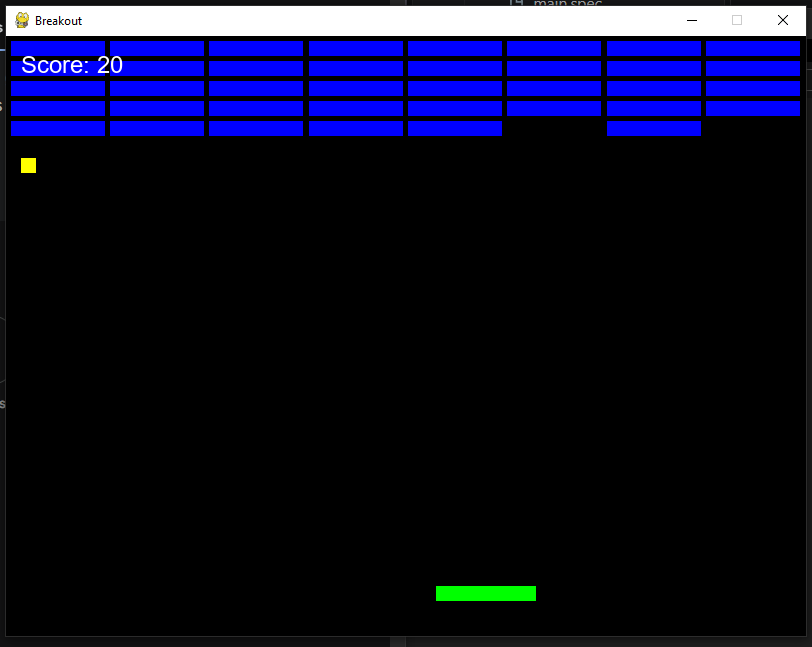
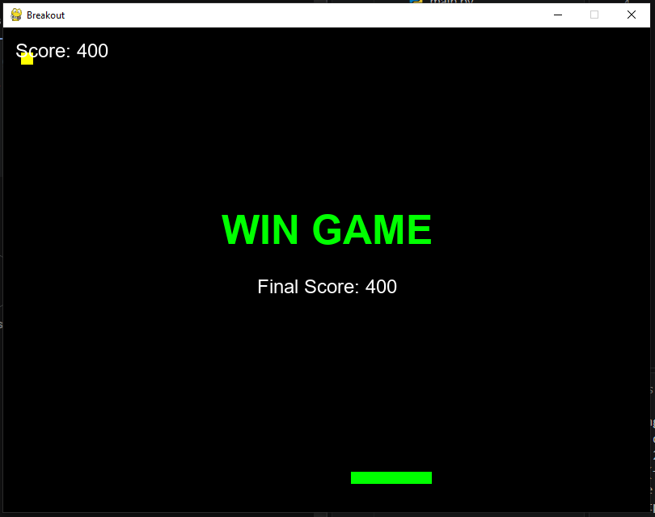

# Breakout

This is a game where you have to break the squares to win (you have to break them all).

# Some Photos

# How to play?
To move the racket, use the arrow keys or A - D (left, right).

# Technologies
The game was made in Python using the pygame library, a suitable library for the development of 2D games.